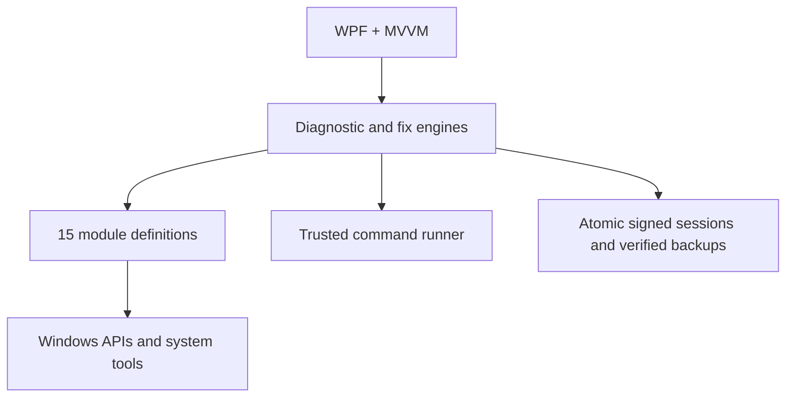

<!-- Copyright (c) 2026 CaYaDev (https://cayadev.com) | GitHub: CaYatur (https://github.com/CaYatur) | Licensed under the MIT License. -->

<div align="center">
  
  <h1>CaYaFix</h1>
  <p>Diagnostics-first Windows troubleshooting with verifiable repair and rollback.</p>
</div>

[](https://github.com/CaYatur/CaYaFix/actions/workflows/ci.yml)
[](https://github.com/CaYatur/CaYaFix/actions/workflows/codeql.yml)
[](LICENSE)
[](https://dotnet.microsoft.com/download/dotnet/8.0)
[](https://github.com/CaYatur/CaYaFix)

CaYaFix is a modern WPF desktop application for diagnosing and repairing common Windows problems. It starts with read-only evidence gathering, maps findings to targeted actions, creates a recoverable backup, applies one change, verifies the action and the originating diagnostic, and records the full session. It does not use one-click scripts that reset unrelated settings, download drivers, collect credentials, or send telemetry.

Repository: [github.com/CaYatur/CaYaFix](https://github.com/CaYatur/CaYaFix)

## GitHub testing

This project is **tested on GitHub** via Actions on `master` (and `main`). Live workflow status is shown in the badges above; runs are listed under [Actions](https://github.com/CaYatur/CaYaFix/actions).

| Workflow | What it verifies |
|---|---|
| **CI** (`ci.yml`) | `validate-repository.ps1`, Release build (`-warnaserror`), unit/integration tests, self-contained `win-x64` publish + artifacts |
| **CodeQL** (`codeql.yml`) | Static security analysis for C# |
| **Screenshots** (`screenshots.yml`) | Real English WPF capture of `dashboard.png`, `findings.png`, `live-tests.png` |
| **Soak** (`soak.yml`) | Scheduled process-isolated soak with memory/handle ceilings |
| **Release** (`release.yml`) | Tagged `v*` builds, zip + SHA-256 checksum upload |

**Local + CI gates that must stay green:**

- Catalog: **15 modules · 68 diagnostics · 63 repairs · 8 live tests**
- xUnit suite (currently **67** tests) with hang detection
- Localization parity (EN/TR), SVG/icon policy, MIT headers, trusted executable allowlist
- Dependabot NuGet and GitHub Actions updates are validated on the same CI path

Harmless dry-run tooling for every repair preview (no system mutation):

```powershell
dotnet run --project .\tools\HarmlessDryRun\HarmlessDryRun.csproj -c Release
.\tools\harmless-tool-smoke.ps1   # read-only OS probes only
```

## Screenshots

These images are captured from the running English WPF application by `tools/capture-readme-screenshots.ps1`. The capture mode loads deterministic in-app demonstration states so the dashboard, findings, and active ping/microphone animations are reproducible; the PNG files are not mockups or generated artwork.


<details>
<summary>Findings and live tests</summary>


</details>

## Highlights

- **15 troubleshooting modules** with **68 diagnostic checks**, **63 repair actions** with transactional recovery, **8 interactive live tests**, and symptom-focused playbooks.
- **Guided symptom repair** when a scan finds nothing: pick a problem area, read risk and side-effect warnings (audio glitches, network drops, display flicker, and similar), then apply related Safe/Moderate repairs.
- **Manual Windows repair tools** (Settings): run Microsoft-oriented tools without waiting for a finding — ipconfig suite, network soft-heal, DISM/SFC steps, Win+Ctrl+Shift+B graphics soft-reset, BCD/WinRE helpers, and more. Aggressive tools still require Force risk acceptance.
- **Live progress for long tools**: themed progress bar with **percent complete**, **estimated remaining minutes**, stage labels, and parsing of DISM/SFC-style console percentages when available.
- Deep network diagnostics: adapter/IP/APIPA/gateway, DNS, captive portal, proxy, VPN residue, target-bound routes, firewall, hosts, Winsock, MTU, services, event-log correlation, IPv4/IPv6 bindings, Wi-Fi/TCP health, live ping/DNS/HTTP/MTU/speed tests, and repairs from soft-heal through stack/full reset.
- Deep audio diagnostics: endpoints, services, levels, formats, enhancements, privacy, Bluetooth/HDMI, event log, disabled PnP devices, live speaker/mic/stability tests, plus enable-all-disabled and rescan repairs.
- **Display/GPU**: adapter and driver health, Display/TDR event correlation, device rescan, restart-all adapters, targeted restart, and **Win+Ctrl+Shift+B** graphics driver soft-reset.
- **System integrity (Microsoft DISM/SFC path)**: CheckHealth, ScanHealth, AnalyzeComponentStore, SFC `/scannow`, DISM RestoreHealth, StartComponentCleanup, and full DISM→SFC chain.
- **Boot & recovery (online-safe)**: WinRE status (`reagentc`), BCD health (`bcdedit`), BCD export backup, recovery flags, enable WinRE, and `bcdboot` rebuild. Offline-only tools such as `bootrec` stay in Windows Recovery Environment and are not automated from the desktop session.
- Disk online `chkdsk /scan` and `/spotfix`, plus scheduled offline repair when needed.
- Additional coverage: Windows Update, printers, Bluetooth, Microsoft Store cache, time sync, startup performance, camera/privacy, USB, Windows Search.
- Three risk tiers: Safe, Moderate, and Aggressive. Reboot actions are queued last; aggressive actions require explicit consent and a restore point (or an explicit skip-with-warning).
- Transactional repair flow: `backup + disk flush → signed write-ahead recovery intent → apply → action verify → diagnostic recheck`, with automatic rollback, startup recovery lock, per-action undo, and reverse-order session recovery.
- Isolated repair parameters, signed session manifests, SHA-256 backup verification, ProgramData ACL lockdown, trusted System32 allowlist, and privacy-redacted support packages.
- Responsive dark UI (EN/TR), SVG icons, expandable module panels (full-screen detail), operation overlay with feed auto-scroll, toasts, and a bounded live console.
- Self-contained single-file Windows x64 publishing.

## Module catalog

| Module | Diagnostics | Repairs | Live tests |
|---|---:|---:|---:|
| Network | 18 | 19 | 5 |
| Audio | 14 | 13 | 3 |
| Windows Update | 3 | 2 | 0 |
| Printers | 4 | 4 | 0 |
| Bluetooth | 2 | 2 | 0 |
| Disk and storage | 5 | 3 | 0 |
| System integrity | 3 | 4 | 0 |
| Microsoft Store | 2 | 1 | 0 |
| Time sync | 2 | 1 | 0 |
| Startup performance | 2 | 1 | 0 |
| Camera and privacy | 2 | 2 | 0 |
| USB devices | 2 | 2 | 0 |
| Windows Search | 2 | 1 | 0 |
| Display and graphics | 4 | 4 | 0 |
| Boot and recovery | 3 | 4 | 0 |
| **Total** | **68** | **63** | **8** |

### Representative Microsoft-oriented tools (selection)

| Area | Examples |
|---|---|
| Network | `ipconfig /flushdns`, `/release`, `/renew`, `/registerdns`; ARP clear; service restart; Winsock/IP stack reset; soft-heal pack |
| Integrity | `DISM /Cleanup-Image /CheckHealth\|ScanHealth\|RestoreHealth\|StartComponentCleanup\|AnalyzeComponentStore`; `SFC /scannow` |
| Graphics | PnP rescan/restart; **Win+Ctrl+Shift+B** soft-reset |
| Boot (online) | `reagentc /info\|/enable`; `bcdedit /export\|/enum\|/set`; `bcdboot %SystemRoot% /f ALL` |
| Disk | `chkdsk /scan`, `/spotfix`; scheduled offline `chkdsk` |

## Safety model

| Tier | Typical action | Backup required | Extra gate |
|---|---|---:|---|
| Safe | Flush DNS, restart a service, soft-heal, rescan devices, export BCD | Yes | None |
| Moderate | Stack/device restart, permission change, online chkdsk spotfix, GPU soft-reset, enable WinRE | Yes | User selection / risk text |
| Aggressive | Driver reinstall, full network reset, DISM RestoreHealth, bcdboot rebuild, scheduled disk repair | Yes (backup-less only with explicit Force consent) | Explicit consent and restore point (or skip-with-warning) |

Every action is individually logged. A failed backup blocks the change unless Force backup-less consent is given for Aggressive only. Before applying a change, CaYaFix flushes backups and writes a signed recovery intent. Interrupted repairs block new work until Recovery Center is cleared. Long operations show percent and ETA; cancellation is available where the pipeline allows it.

Offline-only boot repair (`bootrec /fixmbr`, `/fixboot`, `/rebuildbcd`) is intentionally **not** run from a live desktop session — use Windows Recovery Environment when the OS will not start.

For the detailed threat model, see [docs/SECURITY-MODEL.md](docs/SECURITY-MODEL.md).

## Requirements

### Running a release

- Windows 10 version 2004 (build 19041) or newer, or Windows 11
- 64-bit Windows
- Administrator approval at startup
- No separate .NET installation for the self-contained release

Download `CaYaFix-win-x64.zip` and its `.sha256` file from [GitHub Releases](https://github.com/CaYatur/CaYaFix/releases). Verify the archive before extraction:

```powershell
$expected = (Get-Content .\CaYaFix-win-x64.sha256).Split(' ')[0]
$actual = (Get-FileHash .\CaYaFix-win-x64.zip -Algorithm SHA256).Hash.ToLowerInvariant()
if ($actual -ne $expected) { throw 'Checksum verification failed.' }
Expand-Archive .\CaYaFix-win-x64.zip -DestinationPath .\CaYaFix
Start-Process .\CaYaFix\CaYaFix.exe
```

### Building from source

- Windows 10/11
- [.NET 8 SDK](https://dotnet.microsoft.com/download/dotnet/8.0)
- PowerShell 5.1 or newer
- Visual Studio 2022 is optional

## Build and test

Open an elevated PowerShell window in the repository root:

```powershell
Set-ExecutionPolicy -Scope Process Bypass
.\build.ps1
```

Alternatively, double-click `build-cayafix.bat`. It checks for the .NET 8 SDK, installs the official Microsoft package through Windows Package Manager when needed, uses a process-only PowerShell execution-policy bypass, restores NuGet packages, and then runs validation, build, tests, and publish. It does not change the machine-wide execution policy.

The script restores packages with NuGet auditing enabled, validates repository policy, builds with warnings treated as errors, runs the tests with hang detection, and publishes `publish\win-x64\CaYaFix.exe`.

Useful commands:

```powershell
# Fast development test
dotnet test .\CaYaFix.Tests\CaYaFix.Tests.csproj -c Release

# Repository security and localization checks
.\tools\validate-repository.ps1

# Process-isolated repetition for race, state, and leak regressions
.\tools\soak-test.ps1 -Iterations 50

# Release-candidate repetition
.\tools\soak-test.ps1 -Iterations 200

# Capture actual English UI screenshots for this README
.\tools\capture-readme-screenshots.ps1
```

See [docs/TEST-PLAN.md](docs/TEST-PLAN.md) for the full test matrix and release gates.

## Language behavior

CaYaFix supports exactly two UI languages:

- Turkish when the Windows UI language starts with `tr` (or when Turkish is selected in Settings).
- English for English and every other system language (default when the preference is English or unknown).

The screenshot mode forces English so the project documentation stays consistent. Resource parity is checked in CI; a missing, duplicate, or empty key fails validation. The application deliberately supports only these two resource sets.

## Data and privacy

Machine-wide runtime data is stored under `%ProgramData%\CaYaFix`:

- `Logs`: rolling operational logs, retained for 14 days.
- `Sessions`: atomic signed manifest envelopes, local reports, and action backups.

The current-user DPAPI-protected manifest integrity key is stored separately at `%LocalAppData%\CaYaFix\Security\integrity.key`. Recovery paths reject reparse points and content outside the trusted session root. Both CaYaFix roots use protected, non-inherited Windows ACLs; startup stops if an unexpected principal or inherited access rule is detected.

CaYaFix does not send telemetry. Network live tests contact only the explicitly displayed test endpoints and cap every response. Microphone tests capture and play back a five-second sample in bounded memory, clear the buffers afterward, and never save audio. A support archive is created locally only after confirmation. User/computer and device names, profile paths, device identifiers, GUIDs, Windows SIDs, email addresses, serial values, SSIDs, MAC addresses, IP addresses, Wi-Fi key content, passwords, passphrases, secrets, and tokens are redacted by default; review every file before sharing the archive.

## Architecture



More detail is available in [docs/ARCHITECTURE.md](docs/ARCHITECTURE.md).

## Contributing and security

Read [CONTRIBUTING.md](CONTRIBUTING.md) before opening a pull request. Report security issues privately as described in [SECURITY.md](SECURITY.md); do not publish exploit details in a public issue.

See **[GitHub testing](#github-testing)** above for the full CI matrix. GitHub Actions provides Windows build/test/publish, CodeQL, Dependabot updates, release archives with SHA-256 checksums, a scheduled soak with memory/handle ceilings, and a real-WPF screenshot capture workflow. The screenshot workflow forces English, validates PNG signatures and minimum dimensions, uploads the images as an artifact, and can commit them to the current branch. CI and CodeQL run on pushes to `master` and `main` and on pull requests.

## License and author

CaYaFix is released under the [MIT License](LICENSE).

- Copyright 2026 [CaYaDev](https://cayadev.com)
- GitHub: [CaYatur](https://github.com/CaYatur)
