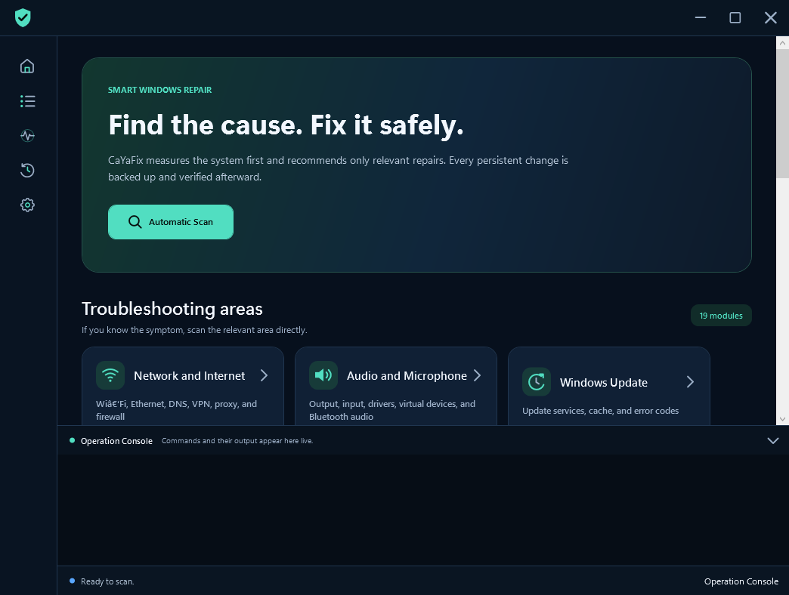
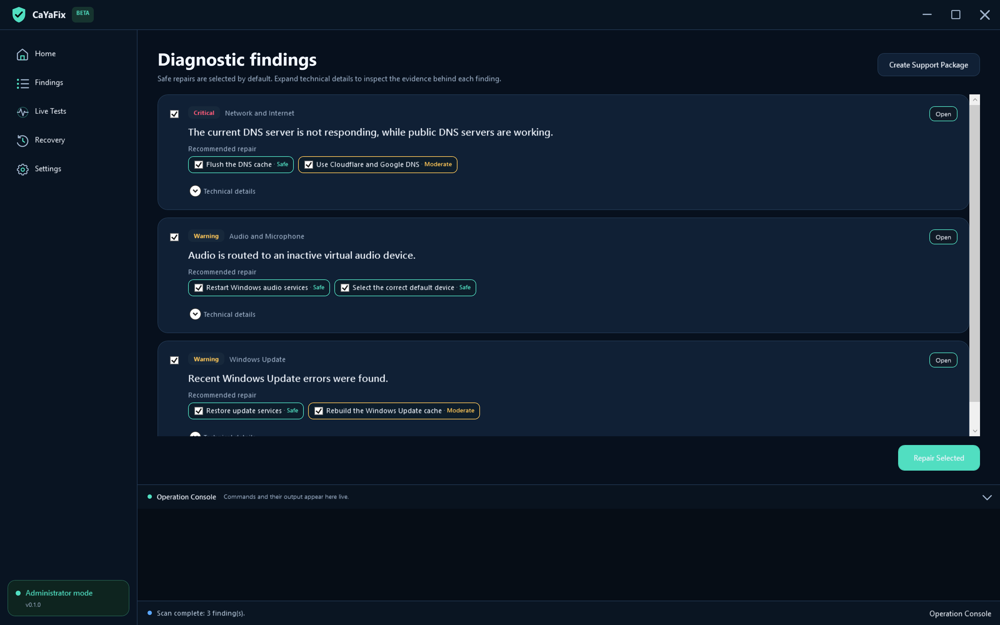
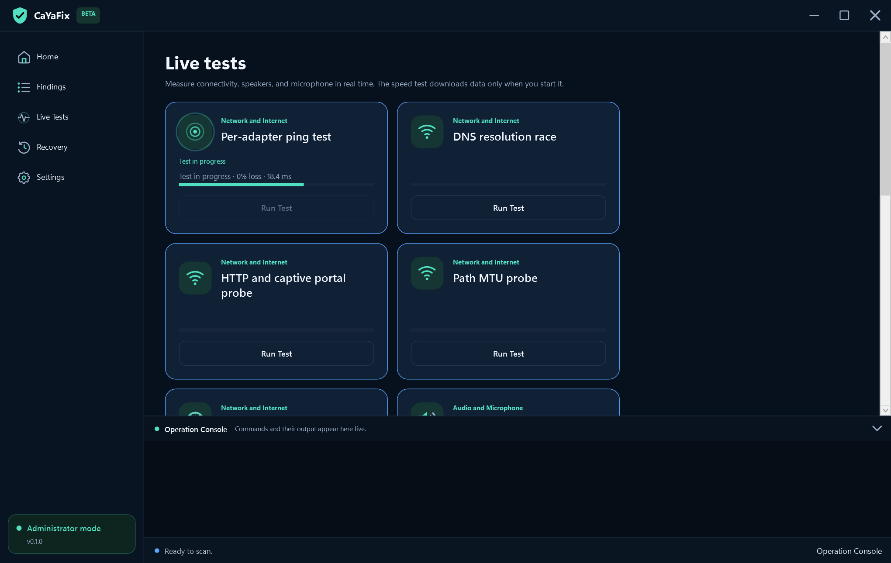

<!-- Copyright (c) 2026 CaYaDev (https://cayadev.com) | GitHub: CaYatur (https://github.com/CaYatur) | Licensed under the MIT License. -->

<div align="center">
  
  <h1>CaYaFix</h1>
  <p>Diagnostics-first Windows troubleshooting with verifiable repair and rollback.</p>
</div>

[](https://github.com/CaYatur/CaYaFix/actions/workflows/ci.yml)
[](https://github.com/CaYatur/CaYaFix/actions/workflows/codeql.yml)
[](LICENSE)
[](https://dotnet.microsoft.com/download/dotnet/8.0)

CaYaFix is a modern WPF desktop application for diagnosing and repairing common Windows problems. It starts with read-only evidence gathering, maps findings to targeted actions, creates a recoverable backup, applies one change, verifies the action and the originating diagnostic, and records the full session. It does not use one-click scripts that reset unrelated settings, download drivers, collect credentials, or send telemetry.

## Screenshots

These images are captured from the running English WPF application by `tools/capture-readme-screenshots.ps1`. The capture mode loads deterministic in-app demonstration states so the dashboard, findings, and active ping/microphone animations are reproducible; the PNG files are not mockups or generated artwork.



<details>
<summary>Findings and live tests</summary>





</details>

## Highlights

- 14 troubleshooting modules with 56 diagnostic checks, 47 repair actions with transactional recovery, 8 interactive live tests, and symptom-focused playbooks.
- Deep network diagnostics: adapter/IP/APIPA/gateway state, DNS comparison, captive portal, proxy, VPN residue, target-bound persistent-route repair, firewall, hosts, Winsock, MTU, services, Wi-Fi/TCP health, latency, jitter, loss, DNS race, animated path-MTU binary search, a 64 KiB-bounded HTTP/NCSI probe, and bounded throughput.
- Deep audio diagnostics: output/input/default endpoints, virtual devices, services, levels, formats, enhancements, privacy, Bluetooth/HDMI routing, speaker channels, bounded in-memory microphone capture/playback, and stream stability.
- Additional coverage for Windows Update, blocked print jobs, offline/default printers, Bluetooth, disk health/dirty volumes/free space, component integrity, Microsoft Store package/cache health, time sync, startup performance, camera/privacy, USB devices, Windows Search, and graphics adapters.
- Three risk tiers: Safe, Moderate, and Aggressive. Reboot actions are queued last; aggressive actions require explicit consent and an available restore point.
- A completed-repair handoff state stops repeat or broader mutation, preserves unresolved evidence, and offers the HTML report, practical hardware/vendor next checks, and a privacy-redacted support package.
- Transactional repair flow: `backup + disk flush -> signed write-ahead recovery intent -> apply -> action verify -> exact diagnostic recheck`, with automatic rollback after apply/verification failure, a startup recovery lock for interrupted repairs, per-action undo, and reverse-order full-session recovery.
- Each targeted repair receives an isolated parameter set, so two device findings cannot overwrite one another's target.
- Atomic signed manifest envelopes and SHA-256 backup verification. Tampered, oversized, reparse-point, path-traversing, or out-of-root recovery data is rejected.
- Machine-wide data directories use a verified protected Windows ACL limited to the current user, SYSTEM, and local Administrators.
- Trusted System32 executable allowlist and argument-array process launch; no shell string concatenation for discovered device targets.
- Privacy-redacted, size-bounded support packages that exclude credentials, browser data, documents, Wi-Fi keys, rollback backups, and microphone recordings.
- Responsive dark UI with SVG-only icons, compact navigation, card transitions, ping pulses, audio waveform animation, a structured severity-aware measurements table, progress, cancellation, and a bounded, batched live console that cannot flood the UI dispatcher.
- Expert mode lists all 47 repairs and can run a single repair with backup and consent gates; target-required repairs still need a prior scan that captured the device target.
- English and Turkish resources. The Windows UI language is detected automatically; English is the fallback for every unsupported language.
- Self-contained single-file Windows x64 publishing.

## Module catalog

| Module | Diagnostics | Repairs | Live tests |
|---|---:|---:|---:|
| Network | 16 | 16 | 5 |
| Audio | 12 | 11 | 3 |
| Windows Update | 3 | 2 | 0 |
| Printers | 4 | 4 | 0 |
| Bluetooth | 2 | 2 | 0 |
| Disk and storage | 4 | 2 | 0 |
| System integrity | 1 | 1 | 0 |
| Microsoft Store | 2 | 1 | 0 |
| Time sync | 2 | 1 | 0 |
| Startup performance | 2 | 1 | 0 |
| Camera and privacy | 2 | 2 | 0 |
| USB devices | 2 | 2 | 0 |
| Windows Search | 2 | 1 | 0 |
| Display and graphics | 2 | 1 | 0 |
| **Total** | **56** | **47** | **8** |

## Safety model

| Tier | Typical action | Backup required | Extra gate |
|---|---|---:|---|
| Safe | Flush cache, restart a service, resync time | Yes | None |
| Moderate | Reset a targeted stack, change a specific permission, restart a device | Yes | User selection |
| Aggressive | Targeted driver removal, conservative network-stack reset, scheduled disk repair, DISM/SFC | Yes (backup-less only with explicit Force consent) | Explicit consent and restore point |

Every action is individually logged. A failed backup blocks the change. Before applying a change, CaYaFix explicitly flushes backup files and durably writes a signed recovery intent that links the action to its verified backup; an unexpected process or power interruption is therefore surfaced in Recovery Center at the next launch. A persistent banner blocks new scans and repairs until the interrupted action is recovered. A successful command is not treated as a successful repair until its verifier and, when appropriate, the exact originating diagnostic both pass. An apply, cancellation, or verification failure triggers automatic rollback. Actions that require a reboot remain pending and are rechecked after Windows has restarted; if the originating diagnostic still fails, verified backups are restored automatically in reverse order. A failed rollback remains visible and recoverable. Historical event-log findings use a current-state verifier instead of waiting for old events to age out.

Automated repair is offered only when CaYaFix can capture and verify an exact recovery path. Component-store repair and Microsoft Store package re-registration remain diagnostic-only because Windows cannot provide a complete transactional undo for those operations. CaYaFix reports their evidence without presenting a misleading rollback promise.

For the detailed threat model, see [docs/SECURITY-MODEL.md](docs/SECURITY-MODEL.md).

## Requirements

### Running a release

- Windows 10 version 2004 (build 19041) or newer, or Windows 11
- 64-bit Windows
- Administrator approval at startup
- No separate .NET installation for the self-contained release

Download `CaYaFix-win-x64.zip` and its `.sha256` file from [GitHub Releases](https://github.com/CaYatur/CaYaFix/releases). Verify the archive before extraction:

```powershell
$expected = (Get-Content .\CaYaFix-win-x64.sha256).Split(' ')[0]
$actual = (Get-FileHash .\CaYaFix-win-x64.zip -Algorithm SHA256).Hash.ToLowerInvariant()
if ($actual -ne $expected) { throw 'Checksum verification failed.' }
Expand-Archive .\CaYaFix-win-x64.zip -DestinationPath .\CaYaFix
Start-Process .\CaYaFix\CaYaFix.exe
```

### Building from source

- Windows 10/11
- [.NET 8 SDK](https://dotnet.microsoft.com/download/dotnet/8.0)
- PowerShell 5.1 or newer
- Visual Studio 2022 is optional

## Build and test

Open an elevated PowerShell window in the repository root:

```powershell
Set-ExecutionPolicy -Scope Process Bypass
.\build.ps1
```

Alternatively, double-click `build-cayafix.bat`. It checks for the .NET 8 SDK, installs the official Microsoft package through Windows Package Manager when needed, uses a process-only PowerShell execution-policy bypass, restores NuGet packages, and then runs validation, build, tests, and publish. It does not change the machine-wide execution policy.

The script restores packages with NuGet auditing enabled, validates repository policy, builds with warnings treated as errors, runs the tests with hang detection, and publishes `publish\win-x64\CaYaFix.exe`.

Useful commands:

```powershell
# Fast development test
dotnet test .\CaYaFix.Tests\CaYaFix.Tests.csproj -c Release

# Repository security and localization checks
.\tools\validate-repository.ps1

# Process-isolated repetition for race, state, and leak regressions
.\tools\soak-test.ps1 -Iterations 50

# Release-candidate repetition
.\tools\soak-test.ps1 -Iterations 200

# Capture actual English UI screenshots for this README
.\tools\capture-readme-screenshots.ps1
```

See [docs/TEST-PLAN.md](docs/TEST-PLAN.md) for the full test matrix and release gates.

## Language behavior

CaYaFix supports exactly two UI languages:

- Turkish when the Windows UI language starts with `tr`.
- English for English and every other system language.

The screenshot mode forces English so the project documentation stays consistent. Resource parity is checked in CI; a missing, duplicate, or empty key fails validation. The application deliberately supports only these two resource sets.

## Data and privacy

Machine-wide runtime data is stored under `%ProgramData%\CaYaFix`:

- `Logs`: rolling operational logs, retained for 14 days.
- `Sessions`: atomic signed manifest envelopes, local reports, and action backups.

The current-user DPAPI-protected manifest integrity key is stored separately at `%LocalAppData%\CaYaFix\Security\integrity.key`. Recovery paths reject reparse points and content outside the trusted session root. Both CaYaFix roots use protected, non-inherited Windows ACLs; startup stops if an unexpected principal or inherited access rule is detected.

CaYaFix does not send telemetry. Network live tests contact only the explicitly displayed test endpoints and cap every response. Microphone tests capture and play back a five-second sample in bounded memory, clear the buffers afterward, and never save audio. A support archive is created locally only after confirmation. User/computer and device names, profile paths, device identifiers, GUIDs, Windows SIDs, email addresses, serial values, SSIDs, MAC addresses, IP addresses, Wi-Fi key content, passwords, passphrases, secrets, and tokens are redacted by default; review every file before sharing the archive.

## Architecture


More detail is available in [docs/ARCHITECTURE.md](docs/ARCHITECTURE.md).

## Contributing and security

Read [CONTRIBUTING.md](CONTRIBUTING.md) before opening a pull request. Report security issues privately as described in [SECURITY.md](SECURITY.md); do not publish exploit details in a public issue.

GitHub Actions provides Windows build/test/publish, CodeQL, dependency updates, release archives with SHA-256 checksums, a scheduled 50-process soak with memory/handle ceilings, and a real-WPF screenshot capture workflow. The screenshot workflow forces English, validates PNG signatures and minimum dimensions, uploads the images as an artifact, and can commit them to the current branch.

## License and author

CaYaFix is released under the [MIT License](LICENSE).

- Copyright 2026 [CaYaDev](https://cayadev.com)
- GitHub: [CaYatur](https://github.com/CaYatur)
