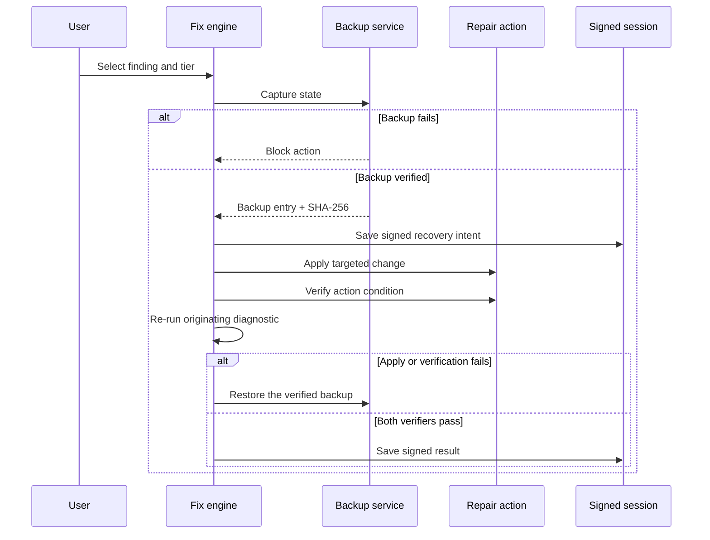

<!-- Copyright (c) 2026 CaYaDev (https://cayadev.com) | GitHub: CaYatur (https://github.com/CaYatur) | Licensed under the MIT License. -->

# CaYaFix Architecture

## Projects

| Project | Responsibility |
|---|---|
| `CaYaFix.App` | WPF views, MVVM state, localization, animations, reports and support-package commands |
| `CaYaFix.Core` | Models, process isolation, diagnostic/fix orchestration, signed sessions, verified backups |
| `CaYaFix.Modules` | Network, audio, and Windows subsystem checks, fixes, live tests, and playbooks |
| `CaYaFix.Tests` | Parser, engine, persistence, privacy, bounds, catalog, target-isolation, tamper, and rollback regression tests |

## Repair transaction

Non-reboot actions are ordered by tier. Reboot actions are moved to the end. An aggressive action is blocked unless the user explicitly accepts the risk and a restore point is available. Each request receives an isolated target dictionary. Before apply, backup files and the signed write-ahead recovery intent are explicitly flushed with the verified backup reference, closing the process/power-loss window before the final result save. If an interrupted action is found on startup, the UI blocks new scans and repairs until recovery succeeds. Cancellation, apply failure, or verification failure initiates rollback with a non-cancellable cleanup token. Recovery can restore one action or all applied actions in reverse order.

## Module contract

Each module exposes metadata, diagnostic checks, repair actions, optional live tests, and symptom playbooks. The current catalog contains **19 modules, 90 diagnostics, 163 repairs, and 8 live tests** (Network, Audio, Update, Printers, Bluetooth, Disk, Integrity, Store, Time, Startup, Camera, USB, Search, Display, Boot & recovery, Windows Security, Explorer & desktop, System access & policy, System core/WMI). Checks return structured findings rather than UI text. Resource keys are resolved by the app so English and Turkish stay synchronized.

A change is eligible for automation only when CaYaFix can capture a pre-change recovery path appropriate to the action (registry/file/service/driver/command-state/bundle or a documented transient marker). Microsoft Store package re-registration remains banned. Offline-only boot tools such as `bootrec` are not launched from a live desktop session; online boot helpers use `reagentc`, `bcdedit`, and `bcdboot` with BCD export first where practical. DISM/SFC repairs are long-running and surface percent/ETA in the operation overlay; they may still require a reboot for full verification.

System processes are launched only through `CommandRunner`. It resolves a fixed allowlist to absolute System32 paths (including `dism`, `sfc`, `ipconfig`, `bcdedit`, `bcdboot`, `reagentc`, and related tools), uses `ProcessStartInfo.ArgumentList`, disables shell execution, enforces timeouts and output bounds, and streams a bounded console view used for live progress parsing.

The UI is WPF with CommunityToolkit MVVM. Responsive width converters collapse navigation labels at compact widths. Full-screen module detail panels, guided symptom repair, Settings manual-tools catalog, operation overlay with themed progress percent/ETA, and a batched live console keep long Microsoft tools usable. SVG assets supply every UI icon. Live-test state triggers ping-pulse and audio-wave storyboards.

## Persistence

Sessions live below `%ProgramData%\CaYaFix\Sessions`. Each `manifest.json` is one atomically replaced envelope containing the manifest and its HMAC-SHA-256 signature, avoiding a detached-signature update window. The 32-byte HMAC key is encrypted with current-user DPAPI and stored at `%LocalAppData%\CaYaFix\Security\integrity.key`. Backup entries contain SHA-256 file or directory hashes. Recovery requires a valid envelope signature, a canonical in-root non-reparse path, recognized restore metadata, and a matching content hash.

Large mutable backups use explicit byte/entry limits and free-space preflight. Windows Update cache, print queue, Microsoft Store cache, driver packages, service configuration, registry state, routes, and audio state have type-specific capture/restore paths. A backup failure stops the repair before apply.
